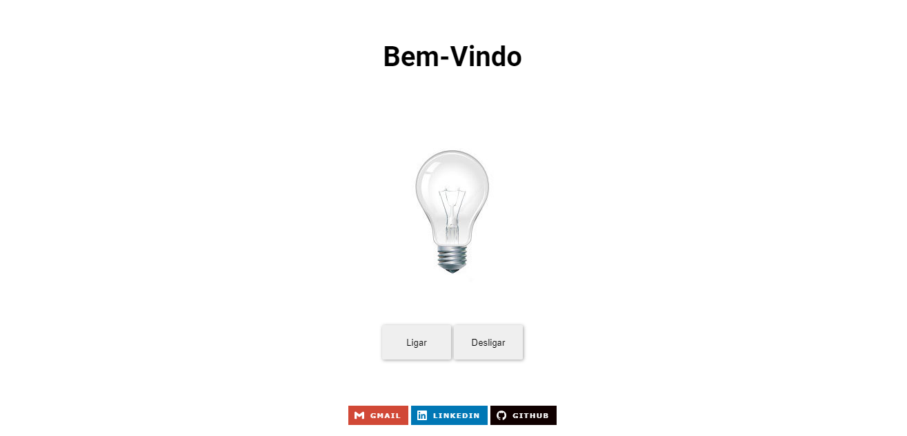
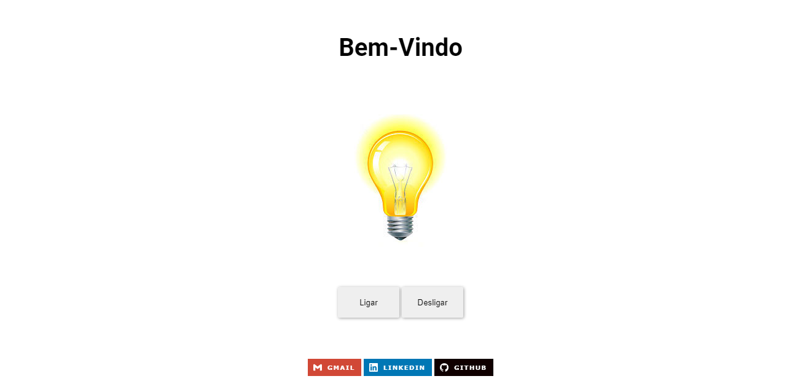
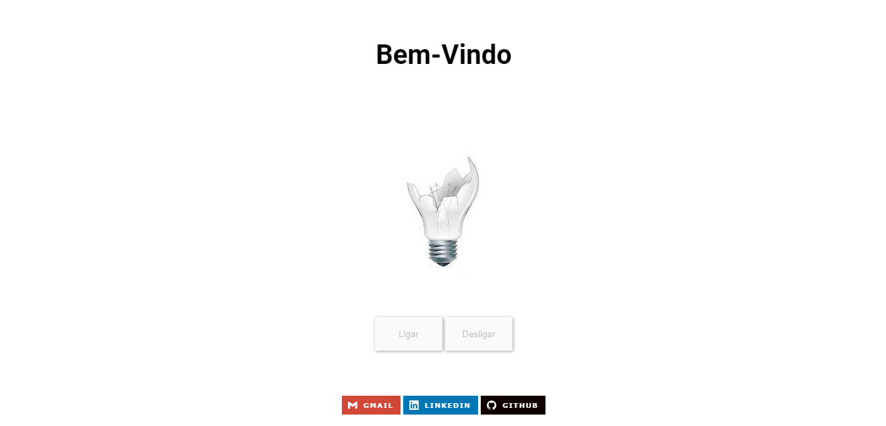

<h1> 🖐 Olá, tudo bem?   <em>🖐 Hello, how are you?</em></h1>
<h4 align="justify">Este e um projeto de uma lâmpada feito em JavaScript, trabalhando com a inserção e a troca de imagens dinâmicas. Este e um projeto feito por mim do qual tirei a inspiração do <a href="https://www.youtube.com/user/thekpta">Fernando Leonid</a>, e da onde tirei as imagens também.</h4>
<h4><em>This is a project of a light bulb, built with JavaScript. Working with DOM and pictures that react to clicks. This is a project made by me and inspired by the video of <a href="https://www.youtube.com/user/thekpta">Fernando Leonid</a> and, I took his pictures too.</em></h4>
 

<h3> 📸 Algumas imagens para vocês verem:  <em>📸 Some photos for you to see</em></h3> 

 

<h3>Caso queira ver o projeto no seu navegador:  <em>If you want to see the project:</em></h3>
<h3><a href="https://hugocamposarimathea.github.io/lampada/"> 👉🏽 Clique aqui! 👈🏽  <em>👉🏽 Click here to go 👈🏽</em></a></h3> 
<h3> 📱 Ou então escaneie o QR Code abaixo:  <em>📱 Scan the QR code below</em></h3>

 

 

 

<h3> 📧 Caso queira conversar comigo:   <em>📧 Some ways to contact me:</em></h3> 

